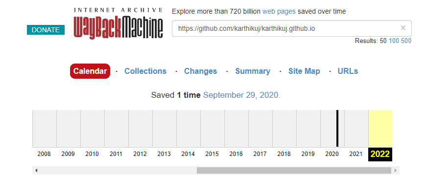
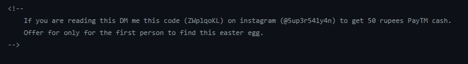

# Challenge Find Code from Karthik bhaiya

## Scenario 1 Social Media:
The first thing to do will be searching full name of the person you are finding about in my case 
  Karthik bhaiya: "Karthik Uj"
 you can search normally but i would suggest using google dorking as it filters your query to the extent you want to

Now i go deeper in the rabbit hole and research more about bhaiya and found out his school (altho it didnt have anything to do with the challeneg i founded out later)

I couldnt found anything but I still insisted on finding the code 

altho I found some things like previous username in one of the social media also irrelevant

All the night I was fixated upon social media 

I wanted to find the code without any hint but i wasn't finding any leads

So I asked bhaiya for a hint  and the hint was 

(IT IS NOT ON ANY OF MY SOCIAL MEDIA PROFILES. You can continue searching whatever remains of me on the internet.)

# Scenario 2 The Portfolio website:
Since it is not on any social media the only thing left for me to check was portfolio website [Portfolio](https://www.5up3r541y4n.tech/)

So i checked if there is any archive of the portfolio website because in the challenge it was said that the code was hidden two years ago

ITs time to go [way back in time](https://web.archive.org/)

sadly nothing found but i didnt loose hope

what if i try to find archive of the github repo of the portfolio
maybe there could be a clue there since i cant find anything else

aha i found an archive  in 2020 which is 2 years ago

lets find whats inside the archive

woho we found the commit on aug 30

when we go to that commit 
we found the code inside index.html

